# Doodle Jump - x86-64 Assembly

> A fully playable Doodle Jump clone written entirely in x86-64 assembly for Windows.
> No engine. No C++. No abstraction. Just bare metal.

---

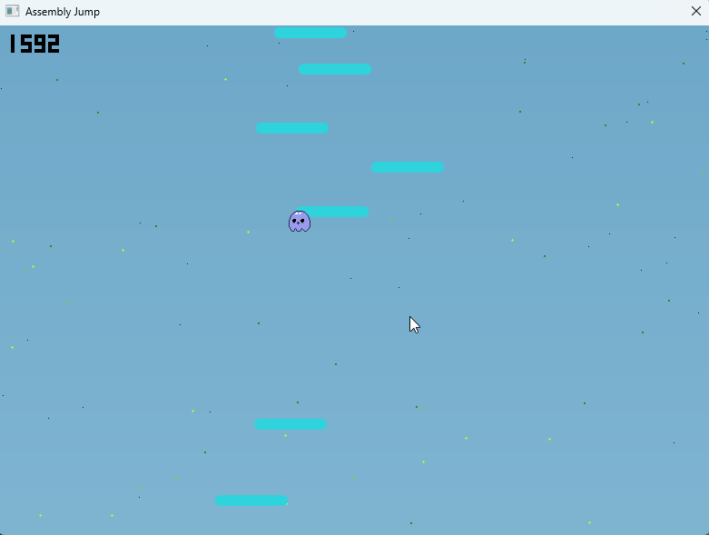

---

## Why Assembly? 🤔

I started this project out of frustration. After spending time working in higher-level languages, I kept feeling like I was writing on top of something I didn't fully understand. Why do we pull in a library for something that could be three instructions? Why does a simple game loop need a framework? Why is everything so slow when the hardware is so fast? 🔍

The deeper issue was abstraction. In Python or JavaScript, a line like `particles.update()` hides everything: the memory layout, the loop structure, the branching, the cache behavior. That is genuinely useful for productivity, and I'm not against it. But it made me realize I couldn't reason about what the machine was actually doing. I was writing recipes, not understanding the kitchen. 🧠

Assembly forces the other direction entirely. There is no hidden cost. Every instruction is a choice. When you write `paddd xmm0, xmm1` you know exactly what happens: four 32-bit additions in parallel, one clock cycle, no overhead. When you write `div ecx` you know it costs around 35 cycles and you start asking whether you really need it. That kind of awareness changes how you think about code at every level. ⚙️

This project is also a statement about optimization. Most software today is layers of abstraction talking to layers of abstraction, and each layer has a cost. None of that is unavoidable. The game in this repo has a full physics engine, particle system, procedural generation, multi-threading, SIMD rendering and real-time audio, all in under 5000 lines of assembly running at 60 FPS with minimal CPU usage.

The C bridge (helper.c) is the one deliberate exception. It exists purely as a demonstration of how assembly and C can interoperate through the Win64 ABI. The Perlin 2D function and the audio helpers could absolutely have been written in assembly, and the calling convention wrappers in helper.asm show exactly how that boundary works. The choice to put those three functions in C was intentional and pedagogical, not a necessity.

---

## Project Structure

```
Assembly_jump/
├── src/
│   ├── main.asm        - Win32 window, game loop, double buffering
│   ├── game.asm        - Game state orchestrator
│   ├── physics.asm     - SSE2 double-precision physics
│   ├── input.asm       - Keyboard input (GetAsyncKeyState, screen wrap)
│   ├── platforms.asm   - Generation, SSE2 collision, scanline rendering
│   ├── particles.asm   - SIMD 4-wide particle system
│   ├── scroll.asm      - Camera and vertical scrolling
│   ├── score.asm       - Score, HUD, AVX2 sky gradient
│   ├── stars.asm       - Parallax fireflies + Brownian motion
│   ├── audio.asm       - FPU synthesis + WaveOut playback
│   ├── thread.asm      - 3 worker threads, SPSC ring buffer, spinlock
│   ├── helper.asm      - NASM to C bridge (Win64 ABI wrappers)
│   ├── helper.c        - Perlin 2D, smooth log, sin(), plat_freq
│   └── kick_data.inc   - Full music track (Strudel -> Python -> ASM)
└── build.bat           - NASM + cl.exe + link build script
```

**Tech stack:**

- Language: NASM x86-64
- Graphics: GDI (`StretchDIBits` on a 32-bit ARGB framebuffer)
- Audio: WinMM (`waveOutOpen`, `waveOutWrite`)
- SIMD: SSE2 + AVX2
- Math: x87 FPU (audio synthesis), SSE2 scalar (physics)
- OS: Windows 64-bit only

---

## Game Loop - Fixed Timestep with QPC

The main loop in `main.asm` uses **QueryPerformanceCounter** (QPC), the Windows kernel's high-resolution clock, to guarantee identical physics behavior regardless of CPU speed.

### Why a fixed timestep?

Without a fixed timestep, physics is tied to FPS. At 30 FPS the player falls slowly; at 300 FPS they clip through platforms. The fixed timestep decouples the simulation from the rendering speed. In a game engine like Unity you get this for free via `Time.fixedDeltaTime`. Here, it's implemented manually with QPC and an accumulator.

This is not a simplified approximation of what real engines do. Unreal Engine uses exactly the same logic on Windows: `FPlatformTime::Seconds()` wraps `QueryPerformanceCounter` internally, and the engine accumulates elapsed time against a fixed simulation step before rendering. The accumulator pattern described here is the same one documented in Glenn Fiedler's "Fix Your Timestep", which is the reference implementation most serious engines follow. The difference is that Unreal abstracts it behind several layers of platform code and engine infrastructure. Here it is written directly, six instructions and a loop.

### How it works

```
1. QueryPerformanceFrequency  -> ticks/second (fixed, called once)
2. Every frame:
     now = QueryPerformanceCounter()
     delta = (now - last) / freq     [in microseconds]
     accumulator += delta
     while accumulator >= 16666us (= 1/60s):
         game_update()       <- physics, input, platforms
         accumulator -= 16666us
     last = now
3. Render: sky -> stars -> platforms -> particles -> player -> HUD
```

`timeBeginPeriod(1)` is called at startup to force the Windows scheduler resolution to **1 ms** (by default it sits at 15.6 ms, which would make the timestep completely unusable for a 60 FPS target).

---

## Physics - SSE2 Scalar Double Precision

`physics.asm` is one of the most instructive files in the project. Physics relies on **scalar SSE2**, meaning XMM registers used for a single 64-bit double (as opposed to 4 floats in parallel).

### Why SSE2 and not x87?

The x87 (Intel's historical floating-point unit, with its stack registers `st0`..`st7`) was the classic solution until SSE2 arrived in 2001. The Win64 calling convention **prohibits** x87 for function arguments and return values, it mandates SSE2. In a C++ codebase the compiler handles this automatically. In assembly you have to know the rule and enforce it yourself. Using `movsd`, `addsd`, `cvttsd2si` guarantees ABI compliance and avoids costly transition penalties between x87 and SSE2 modes.

### The parabolic trajectory - Euler integration

The fundamental equation of vertical motion under constant gravity is:

```
y(t) = y₀ + v₀·t + ½·g·t²
```

This is a second-order polynomial in `t`, which is the definition of a parabola. The player's jump traces a parabola in screen space.

The game does not evaluate this closed-form equation. Instead it uses **Euler's method**: a first-order numerical integration scheme where the derivative is approximated as constant over each small time step. The two update rules are:

```
v[n+1] = v[n] + g·dt
y[n+1] = y[n] + v[n+1]·dt
```

With a fixed `dt` of one frame and `g = 0.5 px/frame²`, this becomes exactly two lines:

```nasm
; vel_y += gravity  (0.5 px/frame^2)
movsd xmm0, [rel vel_y]
addsd xmm0, [rel gravity]       ; v[n+1] = v[n] + 0.5
movsd [rel vel_y], xmm0

; player_y += (int)vel_y
cvttsd2si eax, xmm0             ; truncate double -> int32
add eax, [rel player_y]         ; y[n+1] = y[n] + v[n+1]
mov [rel player_y], eax
```

Why does this produce the correct parabola? Because accumulating a linearly increasing velocity is equivalent to summing an arithmetic series. After `n` frames starting from rest:

```
v[n] = n · g
y[n] = sum(v[0]..v[n]) = g · n(n+1)/2  ≈  ½ · g · n²
```

That `n²` term is what makes the trajectory parabolic. The two assembly instructions implement the entire physics derivation. Unity's `Rigidbody.AddForce` in a `FixedUpdate` loop does exactly the same arithmetic, just hidden behind method calls.

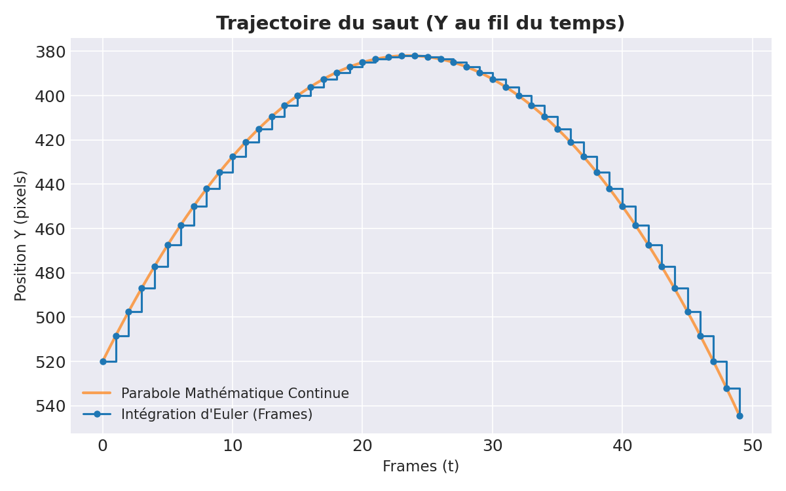

**Physics constants:**

- Gravity: `0.5` px/frame^2 (gentle, arcade feel - realistic gravity would be around 9.8 m/s^2 which at typical game scales feels brutal)
- Jump force: `-12.0` px/frame (negative because Y increases downward in screen coordinates)
- Starting floor: `520` px

At jump initiation, `vel_y` is set to `-12.0`. Each frame adds `+0.5`. The player rises for the first `12.0 / 0.5 = 24 frames` (the apex), then falls for 24 frames to return to the same height. The total arc is 48 frames at 60 FPS, which is 0.8 seconds. The maximum height reached above the jump point is `½ · 12² / 0.5 = 144 pixels`.

**Float comparison without branch misprediction:**

```nasm
; Death check: player_y > 600
cmp eax, SCREEN_H
jg .game_over

; Floor comparison (only active before first scroll):
cvtsi2sd xmm0, eax
movsd xmm1, [rel floor_y_f]   ; 520.0
ucomisd xmm1, xmm0             ; compare without touching integer flags
jae .done
```

`ucomisd` is the SSE2 floating-point comparison instruction. It sets CF and ZF exactly like an integer compare, which lets you use the usual conditional jumps (`jae`, `jbe`...) on doubles without any conversion. In C++ the compiler emits this automatically when you write `if (player_y >= floor_y)`. In assembly you choose the instruction explicitly and understand exactly what it does to the flags.

### Camera and scroll - coordinate reference frame transform

The scroll system in `scroll.asm` is a coordinate system transform. The world extends infinitely upward, but the screen is 600px tall. The solution is to keep the player locked at `y = 200` (the scroll threshold) and instead move all world objects downward.

```nasm
; If player_y < 200: player has risen too high
mov edx, SCROLL_THRESHOLD       ; 200
sub edx, eax                    ; delta = 200 - player_y (positive = player went up)
add [rel player_y], edx         ; push player back down to 200
sub [rel camera_y], edx         ; subtract same delta from camera (camera moved up)
```

`camera_y` accumulates the total vertical displacement of the world. Every platform, star and particle renders at `screen_y = world_y + camera_y`. When `camera_y` is -3000, all world objects render 3000 pixels lower than their logical position, giving the illusion that the camera has risen 3000 pixels. The player's score is derived directly from `abs(camera_y)`. This is the same technique used in every 2D side-scroller since the NES era: a single integer offset applied to every world-space coordinate at render time.

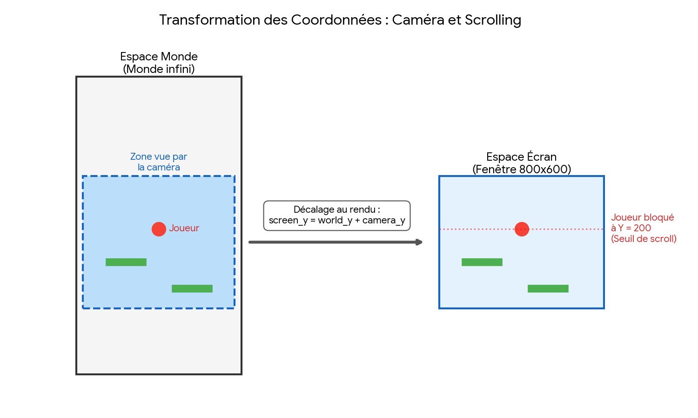

---

## SIMD - What the CPU Actually Does

SIMD stands for _Single Instruction, Multiple Data_: a single instruction operates on multiple values in parallel. In a high-level language, a loop like `for each particle: x += vx` compiles to scalar operations one by one. SIMD lets you process 4 or 8 of those at the same time with no loop overhead.

### SSE2 - 128-bit XMM registers

Registers `xmm0`..`xmm15` are 128 bits wide. Depending on the instruction, they can hold:

- 4 x int32 (`paddd`, `movdqu`)
- 16 x int8 (`psubusb`, `packuswb`)
- 4 x float32 (`addps`)
- 2 x double64 (`addsd` = scalar, `addpd` = 2-wide)

### AVX2 - 256-bit YMM registers

`ymm0`..`ymm15` are 256 bits = 8 x int32. Available on all Intel/AMD processors since 2013 (Haswell / Ryzen 1). AVX2 requires `vzeroupper` after use to avoid a transition penalty back to SSE2.

---

## particles.asm - SIMD 4-Wide Particle System

Disintegration particles appear when the player bounces on a platform. 512 slots, adaptive size (3x3 to 1x1), color fade based on lifetime.

### The original problem

The original `particles_update` contained an integer division **inside the loop** over 512 particles:

```nasm
; ORIGINAL - 512 times per frame:
mov eax, [rel part_grav_tick]
mov edx, 0
mov ecx, 3
div ecx          ; integer division, ~35 cycles on x86-64
test edx, edx
jnz .next
```

`div` is the slowest instruction in the x86 ISA. On a Zen 3 or Ice Lake it takes between 25 and 90 cycles depending on operand size. Multiplied by 512 particles x 60 FPS = **1,843,200 divisions per second** just to decide whether to apply gravity. In C++ the compiler would sometimes optimize a division by a constant into a multiply-shift sequence. In assembly you see the cost immediately and fix it yourself.

### The solution - div outside the loop + SIMD 4-wide

```nasm
; ONE division before the loop
inc dword [rel part_grav_tick]
mov eax, [rel part_grav_tick]
xor edx, edx
mov ecx, 3
div ecx                         ; 1 div per frame, total

; Gravity vector: [1,1,1,1] or [0,0,0,0]
xor ecx, ecx
test edx, edx
setz cl
movd xmm5, ecx
pshufd xmm5, xmm5, 0           ; broadcast -> 4 identical dwords

; Decrement 4 life bytes in 1 instruction (saturation: 0-1 = 0)
movd xmm6, dword [rbx + r12]
psubusb xmm6, xmm7             ; psubusb = unsigned saturating subtract
movd dword [rbx + r12], xmm6

; x[4] += vx[4] in one instruction
movdqu xmm0, [r8  + r12*4]
movdqu xmm1, [r9  + r12*4]
paddd  xmm0, xmm1              ; 4 parallel 32-bit additions
movdqu [r8  + r12*4], xmm0

; vy[4] += gravity (0 or 1)
paddd  xmm3, xmm5
movdqu [r11 + r12*4], xmm3

add r12d, 4                    ; advance 4 particles at once
```

**`psubusb` (Packed Subtract Unsigned Bytes with Saturation)**: subtracts 1 from each byte in an XMM register. If the byte is 0, it stays at 0, no wraparound. Dead particles don't "resurrect", living particles see their lifetime decrease, all in a single instruction operating on 16 bytes at once.

**Result: 512 divisions -> 1, 512 scalar iterations -> 128 SIMD iterations.**

### Fade without division

The original fade applied `component * fade / 255` via three successive `div` instructions:

```nasm
; ORIGINAL: 3 x div per alive particle
imul eax, ebx
xor edx, edx
mov ecx, 255
div ecx          ; ~35 cycles x 3 = 105 cycles just for the fade
```

The optimized version uses two arithmetic tricks:

**Computing the fade factor:**

```nasm
; life * 255 / 60  is exactly equal to  life * 17 >> 2  for all integers in [0,60]
; Proof: 60 * 17 = 1020 -> 1020 >> 2 = 255
;        30 * 17 = 510  -> 510  >> 2 = 127
;        15 * 17 = 255  -> 255  >> 2 = 63
imul eax, 17
shr eax, 2         ; 0 divisions, mathematically exact
```

**Applying the fade:**

```nasm
; component * fade / 255  ~=  component * fade >> 8
; Max error: 1/255 ~= 0.4% - completely invisible visually
imul eax, ebx
shr eax, 8         ; >> 8 = div 256, close enough to div 255
```

**Result: 4 integer divisions -> 0 per particle.**

---

## platforms.asm - SSE2 Scanline Rendering

### Before: pixel by pixel

The original platform rendering loop iterated pixel by pixel over an 80x12 = **960-pixel** grid, with at every pixel:

- 2 margin tests (rounded corners)
- 2 Y bounds checks
- 2 X bounds checks
- 1 multiply (`imul SCREEN_W`)
- 1 memory write

That is ~960 iterations x 7 operations = 6720 operations per platform x 32 platforms = **215,040 operations per frame**. The equivalent in a typical game engine would be a sprite blit call that hides all of this inside a hardware-accelerated draw call. Here every pixel is explicit.

### After: SSE2 scanlines

The new version processes **an entire row at once**:

```nasm
; For each row (12 total):

; 1. Compute screen_y = platform_top + row_index
mov r9d, edi
add r9d, ecx           ; r9d = Y for this row

; 2. One Y bounds check (not one per pixel)
cmp r9d, 0
jl  .skip_row
cmp r9d, SCREEN_H
jge .skip_row

; 3. Read the margin from plat_margins[12]
;    {4,2,1,0,0,0,0,0,0,1,2,4} -> rounded corners
lea rax, [rel plat_margins]
movzx r10d, byte [rax + rcx]

; 4. Compute left_x and right_x once per row
mov r11d, ebx
add r11d, r10d         ; left_x = plat_x + margin
; right_x = plat_x + 80 - margin

; 5. SSE2 fill: 4 pixels per store (~20 stores for the whole row)
movd xmm0, esi
pshufd xmm0, xmm0, 0  ; broadcast color -> [c,c,c,c]
.fill_sse2:
    movdqu [rax], xmm0 ; 4 pixels = 16 bytes, unaligned OK
    add rax, 16
    dec r10d
    jnz .fill_sse2
```

**Result: x10-20 speedup on platform rendering.**

The `plat_margins db 4,2,1,0,0,0,0,0,0,1,2,4` table encodes the rounded corners: the first and last rows clip 4 pixels on each side, creating softened rectangle edges without any trigonometry.

---

## score.asm - AVX2 Sky Gradient

The sky smoothly transitions from daytime blue (`R=135, G=206, B=235`) to deep night blue (`R=0, G=0, B=50`) as the player climbs. The interpolation uses the **Mandelbrot smooth coloring** formula (see helper.c section).

### The 1800-divisions problem

The original computed per row:

```nasm
; ORIGINAL - repeated 600 times:
mov eax, [rsp + 16]    ; delta_R * 256
imul eax, r14d         ; * y
cdq
mov ecx, 600
idiv ecx               ; / 600  <- slow
sar eax, 8
; x3 for R, G, B = 3 x idiv per row x 600 rows = 1800 idiv/frame
```

### The solution - precomputed steps + incremental accumulation

```nasm
; BEFORE THE LOOP: 3 divisions, done once
shl eax, 8
cdq
mov ecx, SCREEN_H
idiv ecx               ; step_R = (delta_R * 256) / 600
push rax               ; store step_R on stack

; acc_R = 0 (in r12d, freed after color computation)
xor r12d, r12d

; INSIDE THE LOOP (600 iterations): additions only
mov eax, r12d
sar eax, 8             ; current R = acc_R >> 8
add eax, ebp           ; + top_R

; Increment: one addition instead of one division
mov ecx, dword [rsp+24]  ; step_R (constant)
add r12d, ecx            ; acc_R += step_R
```

**8.8 fixed-point principle:** `step_R = (delta * 256) / 600` is a number with 8 bits of fractional part. By accumulating this step each row and right-shifting by 8 to read the integer value, we get accurate interpolation with no division inside the loop. A game engine would compute this automatically via a shader interpolation unit. Here the math is explicit.

### AVX2 fill - 8 pixels per instruction

```nasm
movd xmm0, r15d
vpbroadcastd ymm0, xmm0   ; YMM0 = [c, c, c, c, c, c, c, c] (8 x 32-bit pixels)

mov edx, 100              ; 800 pixels / 8 = 100 stores
.sky_fill:
vmovdqu [rcx], ymm0       ; 32 bytes = 8 pixels at once
add rcx, 32
dec edx
jnz .sky_fill

vzeroupper                ; MANDATORY after AVX2 (clears upper YMM lanes)
```

**Total sky_render speedup: x8-15.**

`vzeroupper` deserves an explanation: when a YMM register is written, its state pollutes the mapping with XMM registers. If you then call an SSE2 function without `vzeroupper`, the CPU inserts transition micro-ops that cost dozens of cycles. `vzeroupper` zeroes the upper 128 bits of all YMM registers in a single instruction. A compiler using intrinsics inserts this automatically.

---

## main.asm - AVX2 Framebuffer Copy

The double-buffer works like this: the main thread draws into `backbuffer`, then copies it into `front_buffer` (if the render thread has finished displaying the previous frame), then signals the render thread.

```nasm
; BEFORE: rep movsd - 480,000 iterations of 4 bytes
mov rcx, SCREEN_W * SCREEN_H   ; 480,000
rep movsd

; AFTER: AVX2 - 60,000 iterations of 32 bytes (x8)
mov rcx, SCREEN_W * SCREEN_H / 8   ; 60,000
.avx_fb_copy:
vmovdqu ymm0, [rsi]    ; read 32 bytes from backbuffer
vmovdqu [rdi], ymm0    ; write 32 bytes to front_buffer
add rsi, 32
add rdi, 32
dec rcx
jnz .avx_fb_copy
vzeroupper
```

**Result: x4-8 speedup on the frame copy (1.92 MB in 60,000 stores vs 480,000).**

---

## thread.asm - Multi-Thread Architecture

The game runs on **4 simultaneous threads**. Separating responsibilities prevents screen rendering from blocking the simulation, and platform generation from blocking rendering. In a standard game engine this architecture is managed by a job system or a task graph. Here every synchronization primitive is written.

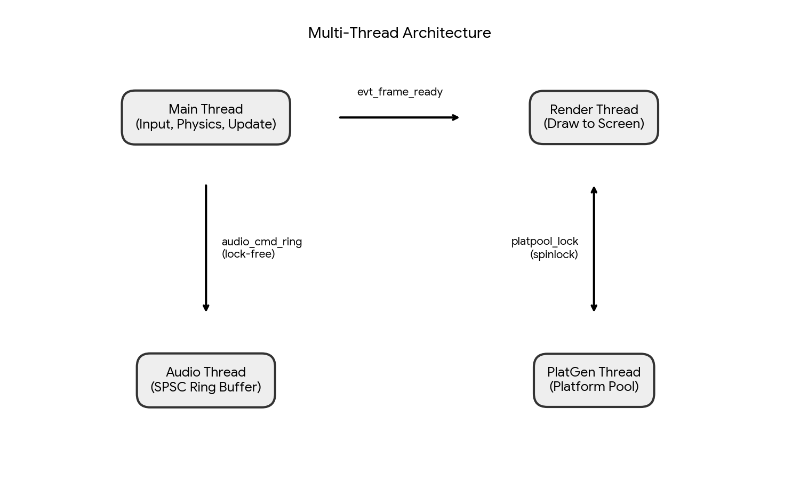

```
Main Thread
|   |- Input (GetAsyncKeyState)
|   |- Physics update
|   |- Platform update (scroll, collision)
|   |- Render: sky -> stars -> platforms -> particles -> player -> HUD
|   +- Copy backbuffer -> front_buffer
|       +- SetEvent(evt_frame_ready) ----------------------+
|                                                          |
Render Thread                                              v
|   |- WaitForSingleObject(evt_frame_ready)                |
|   |- GetDC(hwnd)                                         |
|   |- StretchDIBits(front_buffer -> screen)               |
|   |- ReleaseDC()                                         |
|   +- SetEvent(evt_render_done) <------------------------+

Audio Thread (SPSC Ring Buffer)
|   +- WaitForSingleObject(evt_audio_cmd)
|       +- Dispatch: CMD_PLAY_JUMP / CMD_UPDATE_MUSIC / CMD_STOP_MUSIC

PlatGen Thread (Platform Pre-generation)
|   +- WaitForSingleObject(evt_platgen_needed)
|       +- Pre-generate N platforms into pool (spinlock)
```

### SPSC Ring Buffer (audio)

The main thread cannot call `waveOutWrite` directly without risking a deadlock (the audio API is not thread-safe without precautions). The solution is a **SPSC ring buffer** (Single Producer Single Consumer) of 64 slots.

```nasm
%define AUDIO_CMD_RING_SIZE  64
%define AUDIO_CMD_MASK       63   ; modulo via bitmask (power of 2, no div)

; Main thread (producer):
audio_post_cmd:
    mov eax, [rel audio_ring_head]
    mov [rel audio_cmd_ring + rax*4], ecx  ; write command
    inc eax
    and eax, AUDIO_CMD_MASK                ; wrap via mask (no division)
    mov [rel audio_ring_head], eax
    ; SetEvent(evt_audio_cmd) wakes audio thread
```

The fundamental SPSC property: only one thread writes `head`, only one thread writes `tail`. No mutex required, **lock-free by design**.

### Spinlock for the Platform Pool

```nasm
platpool_lock_acquire:
.spin:
    mov eax, 1
    xchg [rel platpool_lock], eax  ; atomic: test-and-set
    test eax, eax
    jz .got_it
    pause                          ; CPU hint: spin-wait (reduces power and improves HT)
    jmp .spin
.got_it:
    ret

platpool_lock_release:
    mfence                         ; memory barrier (guaranteed store ordering)
    mov dword [rel platpool_lock], 0
```

`xchg` with memory is **implicitly atomic** on x86 (the bus is locked). `pause` is an SSE2 instruction that hints to the CPU that we're in a spin-wait, reducing power consumption and improving performance on HyperThreading architectures. `mfence` ensures that no store reordering can leak the lock state before the data it protects.

---

## stars.asm - Fireflies and Brownian Motion

The fireflies in this game are directly inspired by the **Korok Forest** from The Legend of Zelda. The floating lights drifting through the dark, each with its own lazy rhythm, glowing faintly in the distance. That is the visual reference. The implementation uses Brownian motion to achieve it.

### What is Brownian motion?

Brownian motion (Robert Brown, 1827) describes the random displacement of particles in a fluid, caused by collisions with surrounding molecules. In computer graphics, this behavior is simulated to create entities that feel _alive_: neither teleported, nor frozen, nor mechanical. The key property is that direction changes are rare, gradual and bounded, so the movement looks purposeful even though it is random.

### Three-layer architecture

| Layer | Count | Size                     | Color                     | Effect                         |
| ----- | ----- | ------------------------ | ------------------------- | ------------------------------ |
| 0     | 40    | 1x1 px                   | Dark green `0x00113311`   | Distant, nearly motionless     |
| 1     | 30    | 2x2 px                   | Forest green `0x00338822` | Mid-distance, gentle pulsation |
| 2     | 20    | 3x3 cross + white center | Yellow-green `0x0099FF33` | Close, vivid                   |

### Brownian motion implementation

Each firefly has `vx` in {-1, 0, +1} and `vy` in {-1, 0, +1}.

```nasm
; 1-in-64 chance of changing direction -> erratic but rare behavior
call star_random
test eax, 63          ; if lower 6 bits are non-zero -> no direction change
jnz .apply_vel

; Change vx by -1, 0 or +1 (random)
call star_random
xor edx, edx
mov ecx, 3
div ecx
sub edx, 1            ; edx in {-1, 0, 1}
mov eax, [r14 + rbx*4]
add eax, edx
; Clamp between -1 and +1 (velocity never escapes the bounds)
cmp eax, -1
jge .vx_min
mov eax, -1
.vx_min:
cmp eax, 1
jle .vx_max
mov eax, 1
.vx_max:
```

The velocity is **applied only 1 frame out of 8** (`test star_tick, 7`), slowing the effective movement further. A firefly takes several seconds on average to drift a quarter of the screen. Each firefly also has a `phase` byte (0-255) that modulates its brightness over time, creating the characteristic pulsating glow.

The parallax scroll is implemented differently per layer:

- Layer 0 (background): `screen_y = world_y - camera_y / 4` (scrolls 4x slower than the player)
- Layer 1: `/ 2`
- Layer 2: nearly follows the normal scroll

---

## Procedural Generation - Perlin 2D + LCG

### LCG (Linear Congruential Generator)

The base pseudo-random number generator used throughout the project is a classic LCG:

```nasm
random:
    mov eax, [rel rand_seed]
    imul eax, 1103515245          ; glibc multiplier
    add eax, 12345                ; glibc increment
    mov [rel rand_seed], eax
    shr eax, 16                   ; high bits = better quality
    and eax, 0x7FFF               ; result in [0, 32767]
    ret
```

Each thread has its own seed (`rand_seed`, `platgen_rand_seed`, `star_seed`) to avoid collisions. Only `star_seed` is initialized with `rdtsc ^ 0xCAFEBABE`, making the starfield different on every run.

### Perlin 2D - Natural Platform Placement

The LCG alone produces completely random platforms, sometimes impossible to reach. Perlin noise adds a **continuous spatial bias** that makes placement more organic.

`helper.c` implements a 2D Perlin noise with **Ken Perlin's smoothstep**:

```c
// Fade function: 6t^5 - 15t^4 + 10t^3
// Zero derivative at edges -> smooth transitions, no discontinuity
double u = xf * xf * xf * (xf * (xf * 6.0 - 15.0) + 10.0);
double v = yf * yf * yf * (yf * (yf * 6.0 - 15.0) + 10.0);

// Deterministic hash for the 4 corners of the cell
int h00 = ((xi * 1619 + yi * 31337 + 1013904223) * 1664525) & 0x7FFFFFFF;
// Pseudo-random gradient in [-1.0, +1.0]
double g00 = (h00 / 1073741824.0) - 1.0;

// Bilinear interpolation with fade
double ix0 = g00 + u * (g10 - g00);
double ix1 = g01 + u * (g11 - g01);
return ix0 + v * (ix1 - ix0);
```

The Perlin bias is reduced to 25% (`sar eax, 2`) and added to the LCG-generated X. The effect is subtle but real: platforms form natural clusters rather than being uniformly scattered.

### C to NASM Bridge (helper.asm)

The Win64 calling convention defines:

- Integer arguments: `rcx, rdx, r8, r9`
- Float arguments: `xmm0, xmm1, xmm2, xmm3`
- Integer return: `rax`
- Float return: `xmm0`
- Shadow space: 32 mandatory bytes on the stack before any `call`

The `helper.asm` bridge converts NASM calls to this ABI. This is the only place C appears in the project, and it is intentional: the goal was to demonstrate that the boundary between assembly and C is just a calling convention, and that crossing it manually teaches you everything that a compiler does silently.

```nasm
wrap_perlin2d:          ; (ecx = x_int, edx = y_int) -> eax [-127, +127]
    sub rsp, 40         ; Win64 shadow space (32 bytes + alignment)

    cvtsi2sd xmm0, ecx  ; integer x -> double (first float argument)
    cvtsi2sd xmm1, edx  ; integer y -> double (second float argument)
    call helper_perlin2d ; return value in xmm0 (double)

    ; Scale [-1.0, +1.0] -> [-127, +127]
    movsd xmm1, [rel scale_127]
    mulsd xmm0, xmm1
    cvttsd2si eax, xmm0  ; double -> int32 by truncation

    add rsp, 40
    ret
```

---

## audio.asm - Two Audio Layers

### Layer 1: The Music Track

The background music is a complete stereo track composed in **Strudel**, a live coding music environment based on Tidal Cycles. Strudel lets you write music as patterns in JavaScript, evaluated in real time in the browser.

Here is the exact Strudel pattern used:

```javascript
setCps(140 / 60 / 4);

$: stack(
  stack(
    s("sbd!4").gain(3).clip(0.8),
    s("triangle!4")
      .freq(45)
      .attack(0.01)
      .sustain(0.6)
      .decay(0.8)
      .gain(6)
      .clip(0.5)
      .shape(0.7)
      .lpf(1200),
  )
    .room(1.2)
    .sz(0.9),

  n(
    "< [c2 c2 g2 c2 c2 eb2 g2 f2]!4 [c2 c3 c2 c2 eb3 c2 g2 eb2]!4 [c3 g3 eb3 bb3 c3 f3 g3 c4]!4 [c2 ~ g2 ~ c2 eb2 ~ f2]!4 >",
  )
    .scale("c:minor")
    .s("sawtooth")
    .struct("x*16")
    .lpf(sine.range(300, 4000).slow(8))
    .lpq(15)
    .lpenv(2.5)
    .gain(0.7)
    .delay(0.4)
    .decay(0.5)
    .room(0.3)
    .duck("2:3:4", 0.2, 0.9),
)
  ._pianoroll({
    fold: 1,
    boxColor: "#00ccff",
  })
  ._scope();
```

The pattern layers a sub-bass drum, a triangle sub-oscillator at 45 Hz, and a sawtooth bass line moving through a C minor progression across four evolving sections. The LPF sweeps with a slow sine for movement, ducking is applied to keep the low end clean.

**How audio actually reaches the speaker:**

What `kick_data.inc` contains is the raw PCM data of this track exported as a WAV file. PCM stands for Pulse-Code Modulation: the amplitude of the audio signal is sampled 44100 times per second, and each sample is stored as a 16-bit signed integer. Because the track is stereo (two channels: left and right), the samples are **interleaved**: the file contains [L0, R0, L1, R1, L2, R2, ...], alternating between left and right channel values at 44100 Hz. This means 88200 16-bit values per second, or 176,400 bytes per second flowing from the buffer to the DAC.

The DAC (Digital to Analog Converter) on your sound card converts each digital value to an analog voltage 44100 times per second per channel. That voltage drives the voice coil of the speaker, which moves a cone proportionally to the signal, displacing air and creating a pressure wave your ear perceives as sound. Assembly is directly managing the buffer of numbers that control those physical speaker movements.

**The browser timing problem and the Python pipeline:**

Recording audio from a browser environment like Strudel is not guaranteed to be perfectly in time. The browser's audio engine runs in a sandboxed context, and the recording can have timing drift or micro-offsets that are invisible to the ear but destroy a seamless loop. The Python script detected these offsets by analyzing the waveform shape and confirmed they were present.

The full pipeline:

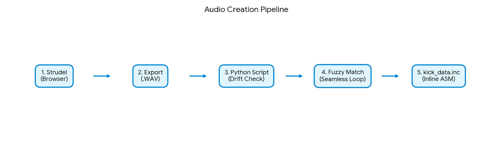

```
Strudel (browser, live coding)
    | export WAV
    v
Python script
    | read WAV -> extract raw 16-bit PCM stereo samples
    | peak normalization (bring to consistent amplitude)
    | cross-correlation sliding window -> detect timing drift from browser
    | manual audio editing to correct misalignments
    | fuzzy waveform matching -> find sample-perfect loop points
    |   (two positions where the waveform shape is nearly identical
    |    guaranteeing no click or phase discontinuity at the loop splice)
    v
kick_data.inc
    | inline dw values directly into NASM .data section
    v
KickData: dw 8113, 9097, 14164, ...
```

Without the fuzzy matching loop detection, a naive loop produces an audible click at every repeat due to the amplitude discontinuity at the splice point. The algorithm finds the loop point where both the amplitude values and the local waveform slope match, making the repeat completely transparent.

**Memory alignment and WaveOut:**

Integrating the audio into the game exposed a real challenge: the WinMM `WAVEHDR` structure must be properly aligned in memory, and its fields must be initialized in the exact order the API expects. Getting a field offset wrong or leaving padding uninitialized causes `waveOutPrepareHeader` to silently fail or crash. In C++ a struct definition handles this. In assembly you count every byte offset manually and zero the header with a loop before filling it:

```nasm
; Zero the entire 64-byte WAVEHDR before filling fields
zero_header64 waveHdr

lea rbx, [rel waveHdr]
mov rax, [rel pBuffer]
mov [rbx],          rax          ; lpData pointer
mov dword [rbx+8],  TotalBufferSize
mov dword [rbx+24], 12           ; WHDR_BEGINLOOP | WHDR_ENDLOOP
mov dword [rbx+28], -1           ; infinite loop count
```

The buffer itself is allocated via `GlobalAlloc` and filled with 4 copies of the track using `RtlMoveMemory`, giving the WaveOut API enough data to loop without rebuffering.

### Layer 2: The Jump Sound - FPU Synthesis

The jump sound is **fully synthesized at initialization** in pure x87 FPU. It does not exist anywhere on disk. It is computed into a RAM buffer at launch time from mathematical parameters alone. The goal here was to demonstrate that assembly can generate audio from scratch, controlling frequency and amplitude over time at the sample level.

**The boing principle - two differential equations running in parallel:**

The sound is described by two coupled recurrences:

```
angle[n+1] = angle[n] + freq[n]           ; angle accumulation (phase)
freq[n+1]  = freq[n]  + accel             ; frequency sweep (chirp)
vol[n+1]   = vol[n]   * decay             ; exponential amplitude decay
sample[n]  = sin(angle[n]) * vol[n] + 128 ; 8-bit PCM centered at 128
```

The angle accumulation is the same Euler integration used in the physics engine, but applied to a phase angle instead of a position. When `freq` is constant, `angle` grows linearly and `sin(angle)` produces a pure tone. When `freq` itself increases each sample (the chirp), the tone rises in pitch: this is a **linear frequency sweep** (chirp signal). In signal processing this is equivalent to FM synthesis with a linearly modulated carrier.

The amplitude follows a **geometric decay**: multiplying by `0.9995` each sample is equivalent to an exponential envelope `vol(t) = vol₀ · e^(-λt)` with `λ = -ln(0.9995) ≈ 0.0005`. After 8000 samples the amplitude is `110 · 0.9995^8000 ≈ 110 · 0.018 ≈ 2`, barely audible. This gives the characteristic "boing" shape: a sharp attack (instant full amplitude) followed by an exponential tail.

The conversion to frequency in Hz: `freq_rad_per_sample * sample_rate / (2π)`. At sample 0, `0.12 * 44100 / 6.283 ≈ 841 Hz`. After 8000 samples, `freq = 0.12 + 8000 * 0.00006 = 0.60`, giving `0.60 * 44100 / 6.283 ≈ 4207 Hz`. The pitch rises by almost two and a half octaves during the sound's 181ms duration.

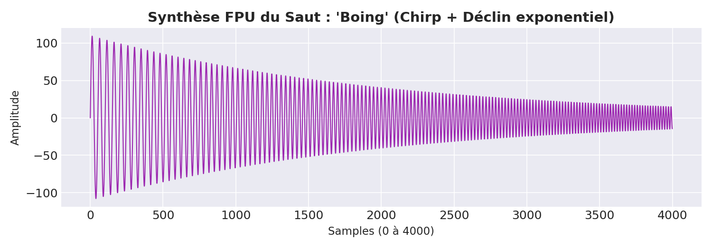

```nasm
.synth_loop:
    fld  qword [rel j_angle]    ; load current angle
    fsin                        ; compute sin(angle), native x87 instruction
    fld  qword [rel j_vol]
    fmulp st1, st0              ; * current volume
    fld  qword [rel j_center]
    faddp st1, st0              ; + 128 (center on 128 for 8-bit PCM)
    fistp qword [rel j_temp]    ; convert to integer (FPU rounding)
    mov  al, byte [rel j_temp]
    mov  [rdi], al              ; write sample to WAV buffer

    ; Frequency sweep: angle += freq (freq increases each sample)
    fld  qword [rel j_angle]
    fadd qword [rel j_freq]
    fstp qword [rel j_angle]

    fld  qword [rel j_freq]
    fadd qword [rel j_freq_accel]    ; +0.00006 rad per sample
    fstp qword [rel j_freq]

    ; Amplitude decay
    fld  qword [rel j_vol]
    fmul qword [rel j_decay]         ; * 0.9995 per sample
    fstp qword [rel j_vol]

    inc  rdi
    dec  rcx
    jnz  .synth_loop
```

**Parameters:**

- Initial frequency: `0.12` rad/sample (~840 Hz at 44100 Hz)
- Acceleration: `0.00006` rad/sample^2
- Initial volume: `110` (8-bit PCM centered on 128)
- Decay: `0.9995` per sample (~8192 samples to reach half amplitude)
- Duration: 8000 samples ~= 181 ms

Why x87 here and not SSE2? Because `fsin` is a native x87 instruction that computes a full sine in 80-bit extended precision in a single instruction. SSE2 has no native sine. You would need a polynomial approximation (like what game engines use in their math libraries). For one sine per sample in an initialization loop that runs once, x87 is the direct and honest choice.

---

## Mobile Platforms - Sinusoidal Oscillation and Desynchronization

20% of platforms are mobile, oscillating horizontally. The position formula for platform `i` at frame `t` is:

```
x(t) = base_x + 40 · sin(t · freq_i + i · 0.7)
```

Three separate mathematical decisions are embedded in this formula.

**Why sine?** The sine function maps a linearly advancing angle to a value that oscillates smoothly between -1 and +1. Its derivative is cosine, which is always bounded and continuous: the platform never teleports or jumps. It reverses direction gradually, decelerating toward the extreme points and accelerating through the center, which is why sinusoidal motion looks natural while linear back-and-forth looks mechanical. The amplitude of 40 pixels means the platform travels 80 pixels peak-to-peak.

**Individual frequencies via prime modulo:**

```c
double helper_plat_freq(int index)
{
    return 0.006 + (double)(index % 7) * 0.0015;
}
```

`freq_i` ranges from `0.006` to `0.0105` rad/tick across 7 distinct values. The modulo by 7 is prime, which ensures the frequency pattern repeats only every 7 platforms, not every 2, 4, or 8, avoiding aligned groups. The slowest platform completes a full cycle in `2π / 0.006 ≈ 1047 frames` (~17.5 seconds at 60 FPS). The fastest completes one in `2π / 0.0105 ≈ 598 frames` (~10 seconds). No two adjacent platforms cycle at the same rate.

**Phase offset via `index * 0.7`:**

Even platforms with the same frequency (which happens every 7 platforms in the index sequence) are shifted in phase by a multiple of 0.7 radians. The constant 0.7 was chosen because it is irrational relative to π (0.7 / π ≈ 0.2228...), so multiples of 0.7 never land on the same phase modulo 2π. Two platforms at index 0 and index 7 have the same frequency but phases of 0 and 4.9 rad, which are completely out of sync. The full computation in assembly:

```nasm
; angle = anim_tick * freq + index * 0.7
mov eax, [rel anim_tick]
cvtsi2sd xmm0, eax
mulsd xmm0, [rel fpu_freq_tmp]      ; tick * freq_i
cvtsi2sd xmm1, r12d                 ; (double)index
mulsd xmm1, xmm2                    ; index * 0.7
addsd xmm0, xmm1                    ; angle
call wrap_sin                       ; sin(angle)
mulsd xmm0, xmm1                    ; * 40.0
cvttsd2si eax, xmm0                 ; truncate to int offset
```

The result: across 32 platforms, every sinusoidal motion is at a unique phase and frequency. No two platforms reach their left extreme at the same frame. The visual effect is that the platforms appear to breathe independently, as if each has its own internal rhythm.

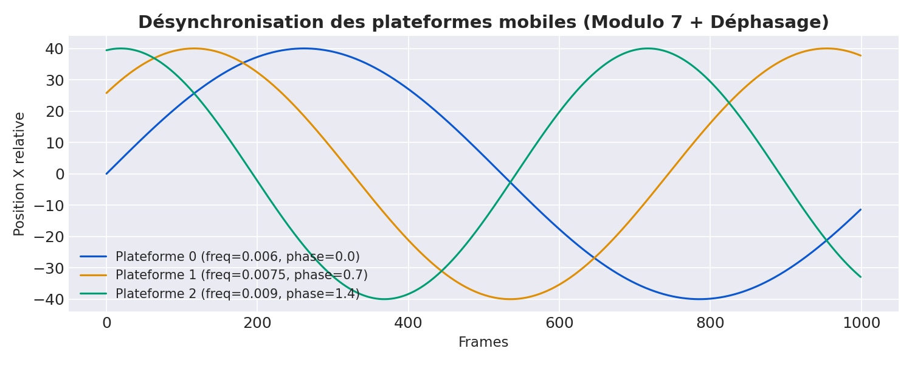

---

## Collision - SSE2 4-Wide Bounding Box

Collision detection between the player (24x24 px) and platforms (80x12 px) uses SSE2 to test 4 conditions simultaneously.

The principle: an AABB (Axis-Aligned Bounding Box) collision requires 4 inequalities:

- `player_right > plat_left`
- `player_left < plat_right`
- `player_bottom > plat_top`
- `player_top < plat_bottom`

In SSE2, these 4 comparisons can be loaded and tested in an XMM register, reducing conditional branches. The additional bounce condition: the player must be **falling** (vel_y > 0) and hit the platform **from above**. A bounce triggers:

1. `vel_y = -12.0` (upward impulse)
2. Particle explosion (spawns ~16 particles around the contact point)
3. `audio_post_cmd(CMD_PLAY_JUMP)` -> the audio thread plays the jump sound

---

## Game Over and Restart

### State machine

The game has two states: **running** and **game over**. The flag `game_over` is a 32-bit integer in the `.bss` section of `physics.asm`, exported globally so that `main.asm`, `game.asm` and `score.asm` can all read it without passing parameters.

When `physics_update` detects `player_y > SCREEN_H` (the player has fallen below the bottom of the screen), it sets `game_over = 1` and returns immediately. From that frame onward, `game_update` is no longer called. The game loop in `main.asm` checks the flag on every tick:

```nasm
.handle_gameover_tick:
    mov rcx, VK_SPACE
    call GetAsyncKeyState
    test ax, 0x8000         ; bit 15: key is currently held down
    jz .tick_loop           ; not pressed: stay in game-over state
    call game_init          ; pressed: full reset
    jmp .tick_loop
```

`GetAsyncKeyState` is a Win32 API that queries the instantaneous state of any virtual key. It returns a 16-bit value; bit 15 (`0x8000`) is set if the key is physically held at the moment of the call. The player presses **SPACE** to restart. When detected, `game_init` is called.

### game_init - full reset in one call

`game_init` in `game.asm` resets the entire game state by calling every module's init function in sequence:

```nasm
game_init:
    mov dword [rel player_x], 380   ; center of 800px screen
    mov dword [rel player_y], 500   ; near the starting floor (520)
    call physics_init               ; vel_y = 0.0, game_over = 0
    call scroll_init                ; camera_y = 0
    call platforms_init             ; regenerate all platforms from scratch
    call score_init                 ; current_score = 0
    mov ecx, CMD_STOP_MUSIC
    call audio_post_cmd             ; silence music, rewind to start
```

Every piece of state is reset explicitly. There is no global `memset`. Each module owns its data and exposes an `_init` function that zeroes or resets it. This is the assembly equivalent of a constructor.

The music stop is a deliberate edge case: when the player dies mid-track, the audio thread is still running and buffering the music. Sending `CMD_STOP_MUSIC` via the ring buffer ensures the audio thread stops playback cleanly before the new game's music starts, preventing a double-play overlap.

### The game over screen - drawn entirely in assembly

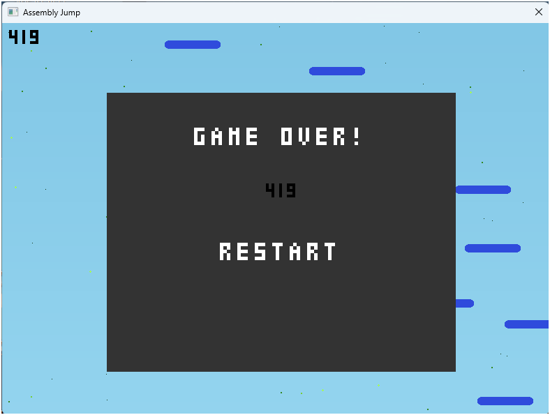

When `game_over = 1`, the render pipeline draws the normal frame (sky, stars, platforms, player still visible frozen in place) and then overlays the game over screen on top:

```nasm
; In main.asm render path:
mov eax, [rel game_over]
cmp eax, 1
jne .submit_frame
call draw_game_over         ; overlay on top of the frozen scene
```

`draw_game_over` in `score.asm` does three things:

1. **Dark rectangle:** a nested pixel loop fills a 500x400 px region centered on screen with `0x00333333` (dark grey), drawn directly into the backbuffer pixel by pixel. No GDI rectangle, no `FillRect`. A double `imul` + `add` computes the framebuffer offset for each pixel: `offset = y * SCREEN_W + x`.

2. **"GAME OVER" text:** rendered via `draw_text_gameover`, which calls `draw_letter_raw` for each letter. Each letter is an index into `letters_bitmap`, a table of 5x3 pixel bitmaps (same system as the score font). The letters are positioned by setting `r14d` (X) and `r15d` (Y) before each call and advancing X by 25 pixels between letters.

3. **Score display:** the current score is decomposed into digits (successive `div 10`, counting digits), then rendered centered on the panel using `draw_number_at`. Centering is computed: `x = 400 - (digit_count * 15) / 2`. The score stays displayed - the player sees exactly how high they climbed before dying.

4. **"PRESS SPACE" prompt:** `draw_text_restart` places a second line of pixel-font text below the score.

Nothing on the game over screen uses Win32 GDI text rendering. Every pixel of every letter is a framebuffer write at a manually computed offset. The game over overlay is composited by drawing it last: since it writes over whatever was already in the backbuffer for those pixels, draw order is the only compositing mechanism.

### Why SPACE and not R or ENTER

`VK_SPACE = 0x20` is the most accessible key: it does not require looking at the keyboard and is never confused with directional input. The left/right arrows (`VK_LEFT = 0x25`, `VK_RIGHT = 0x27`) are the only other keys polled, in `input.asm`. Having restart on a completely separate key prevents accidental restart while still playing.

---

## HSV to RGB - Color Space Conversion in Pure Integer Assembly

Platform colors shift as the player climbs, using a hue that cycles through the color wheel. The hue is derived from `camera_y / 50 mod 360`. Converting that hue to a display color requires HSV (Hue, Saturation, Value) to RGB conversion.

The HSV color model represents color as a position on a circular hue wheel (0-360 degrees), a saturation from grey to pure color, and a brightness value. Converting to RGB requires dividing the hue wheel into 6 sectors of 60 degrees each, and computing three intermediate values (p, q, t) that interpolate between the primary components in that sector.

The mathematical definition (in normalized 0..1 range):

```
sector = floor(H / 60)
f      = (H / 60) - sector          ; fractional part within sector
p      = V · (1 - S)
q      = V · (1 - f·S)
t      = V · (1 - (1-f)·S)

sector 0: R=V,  G=t,  B=p
sector 1: R=q,  G=V,  B=p
sector 2: R=p,  G=V,  B=t
sector 3: R=p,  G=q,  B=V
sector 4: R=t,  G=p,  B=V
sector 5: R=V,  G=p,  B=q
```

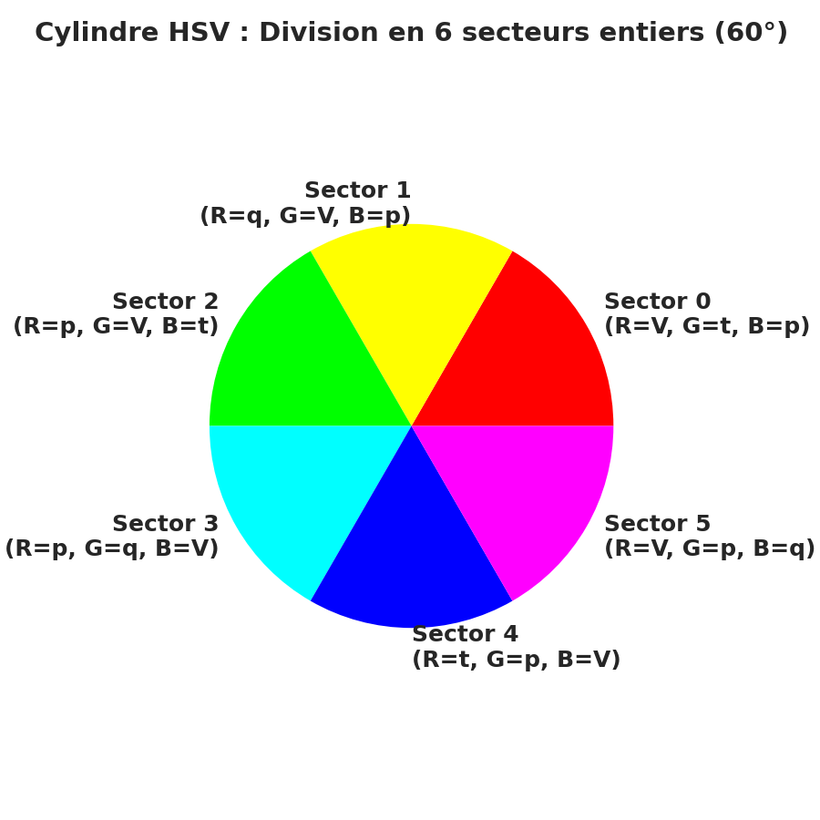

This is implemented in pure x86-64 integer arithmetic with S and V scaled to 0..255. The fractional `f` is computed via integer division remainder, then scaled:

```nasm
; sector = hue / 60
mov eax, r12d       ; hue (0..359)
xor edx, edx
mov ecx, 60
div ecx             ; eax = sector, edx = remainder

; f = remainder * 255 / 60  (scaled fraction 0..255)
imul r15d, 255
div ecx             ; f in 0..255

; p = val * (255 - sat) / 255
mov eax, 255
sub eax, r13d       ; 255 - sat
imul eax, r14d      ; * val
div ecx (=255)      ; p

; q = val * (255 - sat*f/255) / 255
; t = val * (255 - sat*(255-f)/255) / 255
```

Then a 6-way jump selects R, G, B from {V, p, q, t} and packs them into `0x00BBGGRR` with three `shl` + `or` instructions. No floating-point. No lookup table. Six integer divisions total, all in setup, none in the render loop itself.

This is precisely the kind of function that in a game engine would be a library call (`Color.HSVToRGB` in Unity, `FLinearColor::MakeFromHSV8` in Unreal). Here every multiply, divide, subtract and branch is written out and visible.

---

## Smooth Coloring - The Sky as a Mandelbrot

The sky transition formula is directly inspired by **Mandelbrot smooth coloring**. In a classic Mandelbrot render, color depends on the iteration count before divergence, but transitions between bands are harsh. Smooth coloring adds continuous interpolation via:

```
smooth = n + 1 - log(log(|z|^2)) / log(2)
```

Here, the same idea is adapted to the player's altitude:

```c
// helper_smooth_log: altitude -> color intensity
// log(val/1800 + 1) * 110
// val=0     ->   0   (sky blue at start)
// val=3000  -> 108   (mid-transition)
// val=15000 -> 246   (near full night)
double result = log(val / 1800.0 + 1.0) * 110.0;
```

The logarithmic curve progresses quickly at first (visible change from the very first platforms) then flattens at altitude (the sky seems to stop darkening). This is the same perceptual behavior as Mandelbrot smooth coloring: the eye perceives natural transitions instead of hard bands.

---

## Player Sprite - Indexed Pixel Art

### The technique and its history

The player sprite is drawn using **indexed color**: instead of storing a color per pixel directly, you store a small integer (an index) per pixel, and separately define what color each index represents. This is exactly the technique that Game Boy, NES, SNES, and virtually every cartridge-era console used to pack graphics into tiny ROMs.

**Game Boy** pushed this to the extreme. Each tile was 8x8 pixels, and each pixel used only 2 bits, giving 4 possible values (shades of grey mapped through a palette). A single tile was encoded in 16 bytes using two interleaved bitplanes: one byte per row for the low bit of each pixel, one byte per row for the high bit. The final color index for a pixel was `(high_bit << 1) | low_bit`. The hardware PPU (Picture Processing Unit) read these tiles from VRAM and composited them on screen every scanline without any CPU involvement. Game Boy developers drew sprites by writing out these bit patterns by hand, often visualizing the pixels on graph paper first, then translating each row to its hexadecimal bitplane values.

**NES** used the same 2bpp tile system with a CHR ROM chip holding the raw sprite graphics. The 6502 CPU had almost nothing to do with rendering: the PPU handled everything. Developers working on the NES wrote sprite data as arrays of hex bytes, each representing 8 pixels' worth of color index bits.

**SNES** extended this to 4bpp (16 colors per tile) and 8bpp (256 colors), stored in VRAM with a hardware DMA to transfer data from the ROM. Graphics were still integer arrays, just wider ones.

**This project works differently.** There is no dedicated graphics chip. There is no PPU. The CPU reads every byte of the sprite array and writes every pixel to the framebuffer manually, in a software loop. This is exactly how DOS games worked under VGA Mode 13h (320x200, 256 indexed colors): the programmer maintained a buffer in RAM, drew everything by hand with the CPU, then copied the buffer to the VGA memory segment. The difference is that here the framebuffer is 800x600 32-bit ARGB instead of 320x200 8-bit indexed, and the copy uses AVX2 instead of `rep stosd`.

The indexed approach also has a practical advantage even in software: the same sprite data can be redrawn in different colors by just changing the palette mapping. The indices in the array never change. Only the color lookup table changes.

### The sprite data

The 24x24 sprite is stored directly in the `.data` section as 576 `db` values. Reading the raw numbers, you can see the character take shape:

```nasm
doodle_bitmap:
    db 0,0,0,0,0,0,0,0,2,2,2,2,2,2,2,2,0,0,0,0,0,0,0,0  ; top of head outline
    db 0,0,0,0,0,0,2,2,1,1,1,1,1,1,1,1,2,2,0,0,0,0,0,0  ; body starts
    db 0,0,0,0,0,2,1,1,5,5,1,1,5,5,1,1,1,1,2,0,0,0,0,0  ; highlight spots (5)
    db 0,0,0,0,2,1,1,5,5,5,1,5,5,1,1,1,1,1,1,2,0,0,0,0
    ...
    db 0,2,1,1,1,3,3,3,1,1,1,1,1,1,3,3,3,1,1,1,1,1,2,0  ; left eye (3), right eye (3)
    db 2,1,1,1,3,3,3,3,1,1,1,1,1,3,3,3,3,1,1,1,1,1,1,2  ; eye detail
    db 2,1,1,1,3,3,3,3,1,1,1,1,1,3,3,3,3,1,1,1,1,1,1,2
    db 2,1,1,1,1,3,3,1,1,1,3,1,1,1,3,3,1,1,1,1,1,1,1,2
    db 2,1,1,1,4,4,4,1,1,3,1,3,1,1,4,4,4,1,1,1,1,1,1,2  ; cheeks (4), nose expression (3)
    ...
    db 0,2,1,1,1,1,1,2,1,1,1,1,1,1,2,1,1,1,1,1,1,1,2,0  ; legs begin
    db 0,0,2,1,1,1,2,0,2,1,1,1,1,2,0,2,1,1,1,1,1,2,0,0  ; feet split (0 = gap between legs)
    db 0,0,2,1,1,1,2,0,2,1,1,1,1,2,0,0,2,1,1,1,2,0,0,0
    db 0,0,0,2,2,2,0,0,0,2,2,2,2,0,0,0,0,2,2,2,0,0,0,0  ; outline closes at feet
    db 0,0,0,0,0,0,0,0,0,0,0,0,0,0,0,0,0,0,0,0,0,0,0,0  ; empty row
```

The index palette:

```
0 = transparent  (skip, no write to framebuffer)
1 = body         (0x9B9BEE - blue-violet)
2 = outline      (0x2B2B55 - dark blue)
3 = eyes         (0x000000 - black)
4 = cheeks       (pink)
5 = highlight    (white reflection on top of head)
```

The feet are made entirely of zeros (gaps) between outline segments, creating the illusion of two separate legs without any extra data. The legs, eyes, cheeks and highlights are all readable directly in the number grid if you know what to look for.

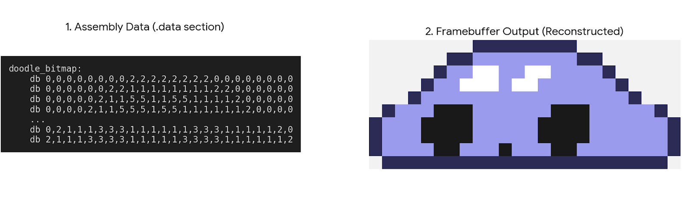

### The rendering loop

```nasm
draw_player:
    lea rsi, [rel backbuffer]
    lea rbx, [rel doodle_bitmap]
    mov r12d, [rel player_x]
    mov r13d, [rel player_y]
    xor r14d, r14d              ; row = 0

.y_loop:
    xor r15d, r15d              ; col = 0
.x_loop:
    ; Read index from sprite array: index = bitmap[row * 24 + col]
    mov eax, r14d
    imul eax, SPRITE_W
    add eax, r15d
    mov cl, byte [rbx + rax]
    cmp cl, 0
    je .next_pixel              ; transparent: skip entirely

    ; Compute screen position
    mov eax, r13d
    add eax, r14d               ; screen_y = player_y + row
    cmp eax, 0
    jl .next_pixel
    cmp eax, SCREEN_H
    jge .next_pixel
    imul eax, SCREEN_W
    mov edx, r12d
    add edx, r15d               ; screen_x = player_x + col
    cmp edx, 0
    jl .next_pixel
    cmp edx, SCREEN_W
    jge .next_pixel
    add eax, edx

    ; Palette lookup via jump table
    cmp cl, 1
    je .col_body
    cmp cl, 2
    je .col_outline
    ...
.col_body:
    mov dword [rsi + rax*4], 0x009B9BEE
    jmp .next_pixel
```

No GPU. No sprite sheet. No texture sampler. Just a loop reading integers and writing colors to a memory buffer, the same fundamental operation that powered every game from the 1970s to the early 3D era.

---

## Score and HUD - 5x3 Assembly Font

Digits and letters are stored as 5-row x 3-column bitmaps:

```nasm
digits_bitmap:
    db 1,1,1, 1,0,1, 1,0,1, 1,0,1, 1,1,1 ; 0
    db 0,1,0, 0,1,0, 0,1,0, 0,1,0, 0,1,0 ; 1
    db 1,1,1, 0,0,1, 1,1,1, 1,0,0, 1,1,1 ; 2
    ...
```

The score is decomposed into digits via successive division/modulo operations, then each digit is drawn pixel by pixel at a computed position on the backbuffer. The HUD is drawn directly into the framebuffer. No GDI text API is used.

---

## Challenges

Assembly development has no safety nets. Here are the real difficulties encountered building this project.

**Stack alignment.** The Win64 ABI requires the stack to be 16-byte aligned before any `call` instruction. Every function entry with pushes, shadow space allocation and local stack usage has to be manually counted to ensure alignment. Getting it wrong causes silent crashes or incorrect SIMD behavior because `movdqa` and similar instructions fault on unaligned memory. Every function in this project has a comment showing the alignment calculation.

**WaveOut memory layout.** The `WAVEHDR` structure passed to `waveOutPrepareHeader` has strict field offsets and must be zeroed before use. In C a struct zero-initializer handles this. In assembly every offset is a literal number you count yourself. Getting one field wrong causes the function to silently fail or corrupt adjacent memory. The loop flag combination (`WHDR_BEGINLOOP | WHDR_ENDLOOP = 12`) is not documented clearly and required testing to confirm.

**Browser timing in Strudel.** Recording audio from a browser-based environment introduces timing drift that is invisible to the ear but measurable in the waveform. The Python script revealed offsets of several milliseconds between the expected beat grid and the actual sample positions. This required manual audio editing to correct before the loop detection could work reliably.

**Thread synchronization without primitives.** Building a lock-free SPSC ring buffer and a spinlock from raw Win32 events and `xchg` instructions requires understanding memory ordering at the hardware level. The `mfence` before releasing the spinlock and the use of `pause` inside the spin loop are not optional details, they are correctness requirements on out-of-order processors.

**SIMD register state across calls.** Mixing SSE2 and AVX2 in the same program without `vzeroupper` causes performance penalties that are invisible in correctness tests but measurable in profiling. Every transition from AVX2 code back to SSE2 code requires `vzeroupper`. Forgetting one causes the CPU to stall at the next SSE2 instruction while it flushes the upper YMM state.

**The div bottleneck.** Integer division by a constant is something a compiler optimizes automatically into a multiply-shift sequence. In assembly you write `div` and pay the full cost until you notice it and fix it manually. Finding the `life * 255 / 60` pattern in the particle renderer and proving that `life * 17 >> 2` is exact required working out the arithmetic by hand.

**Perlin noise calibration.** The Perlin 2D bias on platform placement needed careful scaling. Too much and the platforms cluster into unreachable columns. Too little and the noise has no visible effect. The 25% reduction (`sar eax, 2`) and the coordinate scale (`highest_platform_y >> 7`) were found by iteration.

**ABI compliance for the C bridge.** Every call through `helper.asm` into `helper.c` requires allocating 32 bytes of shadow space, converting integer arguments to doubles via `cvtsi2sd`, and reading the return value from `xmm0`. Forgetting the shadow space causes the callee to corrupt the caller's stack. The conversions between integer registers and XMM registers have to be done explicitly for every argument type.

**No debugger comfort.** Debugging assembly with a symbolic debugger is possible but slow. Most of the debugging in this project was done by writing values into visible memory locations and checking them in the rendered output, or by isolating suspect functions and verifying their output against hand-calculated expected values.

---

## Build

```bat
REM Requirements: NASM, MSVC (cl.exe), Windows SDK x64
build.bat
```

### Why NASM and not the alternatives

Several x86-64 assemblers exist. The choice matters more than it might seem.

**MASM** (Microsoft Macro Assembler) is the assembler that ships with Visual Studio. It uses Intel syntax and integrates cleanly with the MSVC toolchain, but its macro system and directive style push you toward high-level abstractions that paper over what the CPU actually does. Expressions like `PROC` and `ENDP`, `LOCAL`, `INVOKE` generate code you did not explicitly write. The goal here was the opposite.

**GAS** (GNU Assembler, part of binutils) uses AT&T syntax by default: `movl %eax, %ebx` instead of `mov ebx, eax`. Source and destination are swapped compared to Intel documentation, register names carry type suffixes, and immediate values are prefixed with `$`. Readable for people coming from GCC output, uncomfortable for anyone reading Intel manuals directly.

**FASM** (Flat Assembler) is self-hosting and extremely minimal, but its macro system is different enough from standard Intel documentation that porting examples from the Intel manuals requires translation. Its Win64 support exists but is less documented.

**NASM** (Netwide Assembler) hits the right combination:

- Intel syntax matching the official Intel ISA documentation exactly
- `-f win64` produces COFF64 object files that MSVC's `link.exe` accepts directly, with no format translation layer
- `DEFAULT REL` makes all memory references position-independent by default, which is correct for 64-bit Windows code
- The `EXTERN` / `GLOBAL` directives map directly to the COFF symbol table, making multi-file linking predictable
- No hidden prologues, no auto-generated stack frames, no synthetic instructions - what you write is what you get

The key constraint was using MSVC's `link.exe` for the final step. It produces PE32+ executables and understands the Windows SDK import libraries (`kernel32.lib`, `user32.lib`, etc.). NASM's `-f win64` output is compatible with this linker out of the box. Using GCC's `ld` would have required a different object format and a different set of import stubs.

### What the build produces

Running `build.bat` leaves the following files in the `build/` directory:

```
main.obj          game.obj          physics.obj
input.obj         platforms.obj     particles.obj
scroll.obj        score.obj         audio.obj
thread.obj        stars.obj
helper_c.obj      helper_wrap.obj
doodle.exp        doodle.lib        doodle.exe
```

**The `.obj` files** are COFF64 object files, one per source file. Each one contains the machine code for that module plus a symbol table listing which functions it defines (exported symbols) and which ones it needs from other modules (external references). At this stage nothing is resolved: a `call particles_update` in `platforms.obj` is just a placeholder address with a relocation entry saying "fill this in at link time".

**`helper_c.obj`** is produced by `cl.exe /c` from `helper.c`. It is also a COFF64 object file, identical in format to the NASM-produced objects. The C compiler and the assembler produce the same format. The linker does not care which tool generated each `.obj`.

**`helper_wrap.obj`** is produced by NASM from `helper.asm`. The two names are intentional: if both were named `helper.obj`, the second compilation would silently overwrite the first. `helper_c.obj` and `helper_wrap.obj` are kept distinct to make the two compilation passes explicit.

**`doodle.exp` and `doodle.lib`** are a side effect of the linker. When `link.exe` processes the symbol table and resolves all cross-module references, it also emits an export table for symbols marked with `/EXPORT` or declared in a `.def` file. Even without an explicit export list, the linker produces these two files as part of its normal PE32+ build process. `doodle.lib` is an import library (it would let another program call into `doodle.exe` at runtime as if it were a DLL). `doodle.exp` is the export object that `doodle.lib` references. Neither file is needed to run the game. They are linker bookkeeping artifacts that can be ignored or deleted.

**`doodle.exe`** is a PE32+ executable. It contains:

- All machine code from all `.obj` files, laid out in a `.text` section
- All initialized data (bitmaps, audio samples, platform tables) in a `.data` section
- Uninitialized BSS data (framebuffers, particle arrays, thread state) in a `.bss` section that is zeroed by the OS loader at startup
- An import table listing the Win32 DLL functions used (`CreateWindowExA`, `waveOutOpen`, `CreateThread`, etc.) - the OS loader resolves these at startup by looking them up in the actual DLLs
- A PE header describing the entry point (`Start`, the label in `main.asm`), the required subsystem (`WINDOWS`, which suppresses the console window), and the target machine (`X64`)

The `/ENTRY:Start` flag is the reason there is no `main()` function. In a normal C program, the CRT startup code calls `main`. Here the linker is told explicitly that execution begins at `Start`. The first instruction of `Start` is the first instruction the CPU executes after the OS loader finishes setting up the process.

The executable has no external dependencies beyond the standard Windows DLLs (`kernel32.dll`, `user32.dll`, `gdi32.dll`, `winmm.dll`) that are present on every Windows installation. The UCRT functions used in `helper.c` (`sin`, `cos`, `log`, `pow`) are statically linked via `ucrt.lib` and `libvcruntime.lib`, so there is no Visual C++ redistributable requirement either.

---

## SIMD Optimization Summary

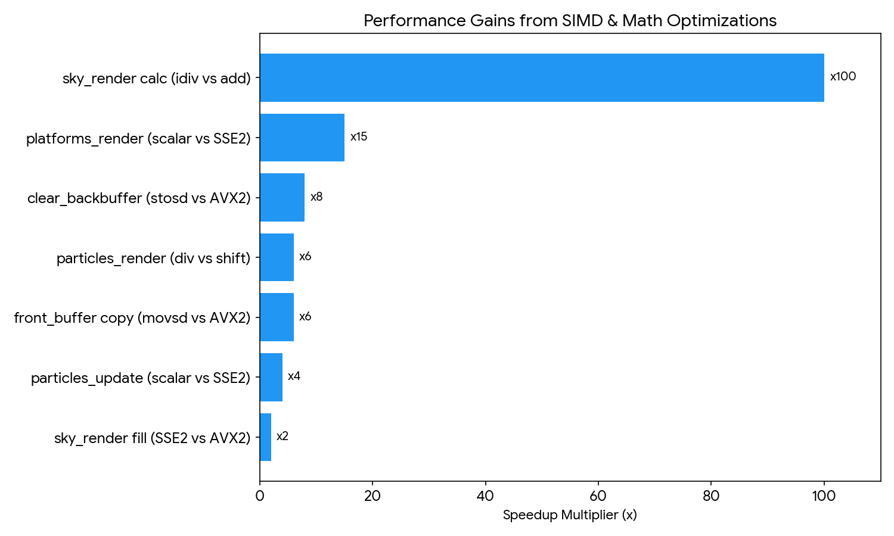

| Function            | Before                      | After                  | Speedup |
| ------------------- | --------------------------- | ---------------------- | ------- |
| `clear_backbuffer`  | `rep stosd` 480k iterations | AVX2 8px/store 60k     | x8      |
| `particles_update`  | 512x `div` + scalar loop    | 1x `div` + SSE2 4-wide | x4+     |
| `particles_render`  | 4x `div` per particle       | 0 `div` (mul + shift)  | x5-8    |
| `platforms_render`  | 960 pixels/platform scalar  | 12 SSE2 scanlines      | x10-20  |
| `sky_render` fill   | 200x `movdqu` SSE2          | 100x `vmovdqu` AVX2    | x2      |
| `sky_render` calc   | 1800x `idiv` per frame      | 3x `idiv` + additions  | x100+   |
| `front_buffer` copy | `rep movsd` 480k            | AVX2 60k               | x4-8    |

---

## What This Project Demonstrates

- x86-64 ISA mastery: scalar, vector (SSE2/AVX2), FPU, and atomic instructions
- Win64 ABI fluency: shadow space, callee/caller-saved registers, float argument passing conventions
- Low-level multi-threading: Win32 events, lock-free SPSC, spinlock with `pause` + `mfence`
- Division-free arithmetic: replacing `div`/`idiv` with multiply + shift (fixed-point, exact identities)
- Complete audio pipeline: from live coding in Strudel, through Python normalization and fuzzy-matched loop detection, to a sample-perfect track embedded in the binary, with manual PCM-level control over the signal sent to the speaker
- Real-time FPU synthesis: frequency sweep + decay envelope, generated entirely at init with x87 `fsin`
- Procedural generation: LCG + bicubic 2D Perlin noise via C bridge, prime-modulo frequency desynchronization
- Double-precision physics: 64-bit SSE2 scalar, `ucomisd` for float comparison, `cvttsd2si` for int conversion
- Rendering pipeline: logarithmic Mandelbrot-style sky gradient, multi-layer parallax, Brownian fireflies inspired by Korok Forest, adaptive particle fade

> "The fastest code is the code that doesn't run. The second fastest is the code you wrote yourself in assembly."
